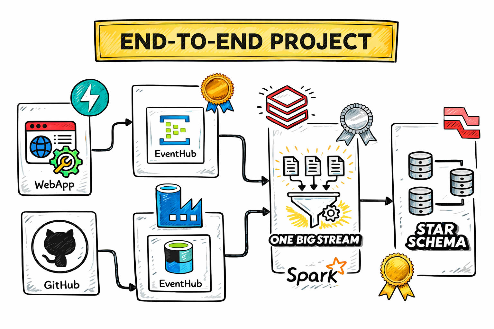
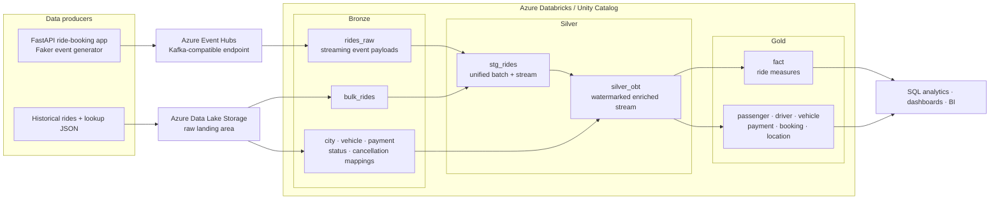

# Real-Time Uber Ride Lakehouse

[](https://azure.microsoft.com/products/event-hubs)
[](https://www.databricks.com/)
[](https://spark.apache.org/)
[](https://fastapi.tiangolo.com/)
[](https://delta.io/)

An end-to-end ride-booking data engineering project that combines **real-time events** and an **initial batch load** in an Azure Databricks lakehouse. A FastAPI web application generates synthetic Uber-style rides, Azure Event Hubs transports the events, and Lakeflow Declarative Pipelines transforms them into an enriched one-big-table stream and an analytics-ready dimensional model.

> The project demonstrates event-driven ingestion, Spark Structured Streaming, batch-and-stream unification, watermarked stream enrichment, Delta tables, SCD Type 1 and Type 2 processing, and star-schema modeling.



## Architecture



For more detail, see [Architecture](docs/ARCHITECTURE.md) and [Data model](docs/DATA_MODEL.md).

## What this project demonstrates

- **Event generation:** Faker creates realistic ride, passenger, driver, vehicle, location, fare, payment, and status attributes.
- **Web-to-stream integration:** a FastAPI booking interface sends each generated ride to Azure Event Hubs.
- **Kafka-compatible ingestion:** Spark reads Event Hubs through its Kafka endpoint using SASL/SSL.
- **Batch and stream unification:** Lakeflow append flows combine historical `bulk_rides` with live `rides_raw` events in `stg_rides`.
- **Stream enrichment:** the ride stream joins static mapping tables into a denormalized OBT with a three-minute event-time watermark.
- **Dimensional modeling:** Gold maintains passenger, driver, vehicle, payment, booking, and location dimensions plus a ride fact table.
- **Change tracking:** most Gold entities use SCD Type 1, while location uses SCD Type 2 based on mapping update time.

## End-to-end data flow

1. A user opens the FastAPI booking page and requests a synthetic ride.
2. The application generates a ride event and publishes its JSON payload to Azure Event Hubs.
3. `ingest.py` consumes the Event Hub with Spark Structured Streaming and stores the raw payload as `rides_raw`.
4. The initial JSON dataset and mapping files are loaded from Azure storage into Bronze Delta tables.
5. Two append flows merge `bulk_rides` and parsed live events into `stg_rides`.
6. `silver_obt.sql` enriches rides with vehicle, payment, status, city, and cancellation attributes.
7. `model.py` projects the OBT into Gold dimensions and a fact table using Lakeflow CDC flows.
8. SQL warehouses, dashboards, and BI tools query the star schema.

## Technology stack

| Layer | Technology | Purpose |
|---|---|---|
| Event producer | Python, Faker | Generate synthetic Uber-style ride records |
| User interface | FastAPI, Jinja2, Uvicorn | Simulate ride booking and confirmation |
| Event transport | Azure Event Hubs | Deliver real-time ride events |
| Batch landing | Azure Data Lake Storage | Store initial rides and reference JSON files |
| Processing | PySpark, Structured Streaming | Parse, combine, enrich, and model data |
| Pipeline framework | Lakeflow Declarative Pipelines | Define streaming tables, append flows, and CDC flows |
| Storage/governance | Delta Lake, Unity Catalog | Persist governed lakehouse tables |
| Modeling | OBT + dimensional model | Serve analytical facts and dimensions |

## Data layers

### Bronze — source-aligned data

| Object | Source | Description |
|---|---|---|
| `rides_raw` | Event Hubs | Kafka metadata plus the ride JSON payload cast to `rides` |
| `bulk_rides` | ADLS JSON | Initial historical ride dataset |
| `map_cities` | ADLS JSON | City, state, region, and update metadata |
| `map_vehicle_types` | ADLS JSON | Ride type and rate information |
| `map_vehicle_makes` | ADLS JSON | Vehicle-make lookup |
| `map_payment_methods` | ADLS JSON | Payment behavior flags |
| `map_ride_statuses` | ADLS JSON | Completed/cancelled status mapping |
| `map_cancellation_reasons` | ADLS JSON | Cancellation reason mapping |

### Silver — unified and enriched rides

`stg_rides` combines the one-time historical stream and continuous event stream. Live JSON is parsed with an explicit Spark schema. `silver_obt` joins the mapping data to the rides and exposes one enriched row per ride event.

### Gold — star schema

- `fact`: ride distance, duration, fares, surge, tips, ratings, and pricing rates
- `dim_passenger`: passenger contact attributes
- `dim_driver`: driver contact, license, and rating attributes
- `dim_vehicle`: vehicle identifiers, make, type, model, color, and plate
- `dim_payment`: payment method and authentication/card flags
- `dim_booking`: confirmation, status, timestamps, and pickup/drop-off details
- `dim_location`: city, state, and region history using SCD Type 2

## Repository structure

```text
.
├── api.py                             # FastAPI routes
├── connection.py                      # Event Hubs producer
├── data.py                            # Synthetic ride generator and mappings
├── templates/                         # Booking and confirmation pages
├── Data/                              # Initial ride and lookup JSON files
├── Code_Files/
│   ├── bronze_adls.ipynb              # ADLS-to-Bronze initial load
│   ├── ingest.py                      # Event Hubs streaming ingestion
│   ├── silver.py                      # Batch/stream union into stg_rides
│   ├── silver_obt.sql                 # Watermarked stream enrichment
│   ├── silver_obt.ipynb               # OBT development and validation
│   └── model.py                       # Gold CDC dimensions and fact
├── architecture.png
├── Uber_Project.svg                   # Editable architecture source
├── pyproject.toml
├── uv.lock
└── requirements.txt
```

## Prerequisites

- Python 3.12+
- `uv` or another Python environment manager
- Azure Event Hubs and Azure Data Lake Storage
- Azure Databricks with Unity Catalog
- A Lakeflow Declarative Pipeline containing the Python and SQL transformations
- Permission to create and read the configured `uber` catalog objects

## Local application setup

### 1. Clone and install

```bash
git clone https://github.com/AdarshDamarla-Git/Uber-Project.git
cd Uber-Project
uv sync
```

Alternatively, use a virtual environment and `pip install -e .`.

### 2. Configure Event Hubs

```bash
cp .env.example .env
```

Set `CONNECTION_STRING` and `EVENT_HUBNAME`. Do not commit real credentials.

### 3. Start the booking simulator

```bash
uv run uvicorn api:app --reload --host 0.0.0.0 --port 8000
```

Open [http://localhost:8000](http://localhost:8000). The `/book` route creates a ride, publishes it to Event Hubs, and displays the confirmation page.

To publish one event without the UI:

```bash
uv run python connection.py
```

## Azure and Databricks setup

### 1. Create source resources

Create an Event Hubs namespace and event hub, then upload the files in `Data/` to an ADLS raw landing path. The repository's current example configuration uses namespace `uberevents` and event hub `ubertopic`; change or parameterize these names for your environment.

### 2. Load reference and historical data

Import and run `Code_Files/bronze_adls.ipynb`. Replace its storage URL and token placeholders with your governed storage configuration. The notebook creates lookup tables and initializes `uber.bronze.bulk_rides`.

For production, use Unity Catalog external locations, storage credentials, or managed volumes instead of embedding SAS tokens in notebook URLs.

### 3. Configure the streaming connection

`ingest.py` reads the Event Hubs connection string from Spark configuration key `connection_string`. Supply it securely through pipeline configuration or a Databricks secret mechanism.

### 4. Create the Lakeflow pipeline

Add these sources:

```text
Code_Files/ingest.py
Code_Files/silver.py
Code_Files/silver_obt.sql
Code_Files/model.py
```

Configure the target catalog/schema to match the project table references. Start the pipeline after the Bronze lookup tables and historical data exist.

## Validate the pipeline

```sql
SELECT rides, timestamp
FROM uber.bronze.rides_raw
ORDER BY timestamp DESC
LIMIT 10;

SELECT COUNT(*) AS staged_rides FROM uber.bronze.stg_rides;

SELECT ride_id, pickup_city, vehicle_type, payment_method, total_fare
FROM uber.bronze.silver_obt
LIMIT 20;

SELECT
  l.region,
  COUNT(*) AS rides,
  ROUND(SUM(f.total_fare), 2) AS total_revenue
FROM uber.bronze.fact AS f
JOIN uber.bronze.dim_location AS l
  ON f.pickup_city_id = l.pickup_city_id
 AND l.__END_AT IS NULL
GROUP BY l.region
ORDER BY total_revenue DESC;
```

## Analytics use cases

- Ride count and revenue by city or region
- Average fare and trip duration by vehicle type
- Surge-pricing behavior by time and location
- Driver performance using driver and rider ratings
- Payment-method usage and cancellation trends
- Tip behavior by trip value, location, or vehicle category
- Current versus historical city attributes through SCD Type 2

## Design notes

- `stg_rides` uses two append flows to unify bulk and live data without maintaining separate downstream logic.
- The OBT applies a three-minute watermark on `booking_timestamp` before joining reference tables.
- Gold uses SCD Type 1 for passenger, driver, vehicle, payment, booking, and fact records.
- Location uses SCD Type 2 with `city_updated_at` as its sequencing column.
- All generated personal and geographic data is synthetic.

## Recommended production improvements

- Add data-quality expectations for required IDs, valid coordinates, non-negative fares, and timestamp ordering.
- Use a business-event timestamp for CDC sequencing instead of an identifier where records can change.
- Standardize fully qualified table names and catalog/schema settings across pipeline files.
- Store Event Hubs and ADLS credentials in secret scopes or workload identity.
- Add a quarantine path for malformed JSON and monitoring for throughput, lag, and lookup misses.
- Add automated tests, CI/CD, environment parameters, and a Databricks Asset Bundle.

## Documentation

- [Detailed architecture and streaming sequence](docs/ARCHITECTURE.md)
- [Gold data model and table grains](docs/DATA_MODEL.md)
- [Deployment and operations guide](docs/DEPLOYMENT.md)
- [Portfolio-ready project summary](docs/PROJECT_SHOWCASE.md)

## Author

**Adarsh Damarla** · [GitHub](https://github.com/AdarshDamarla-Git)

