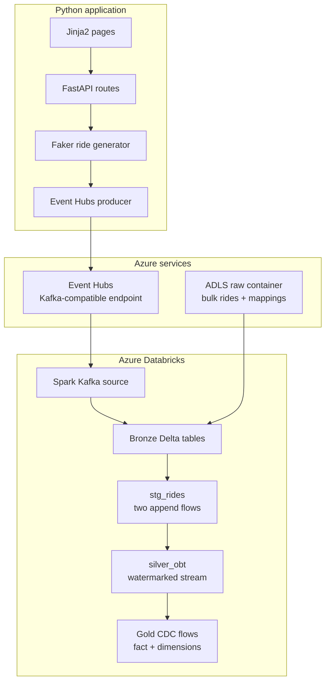
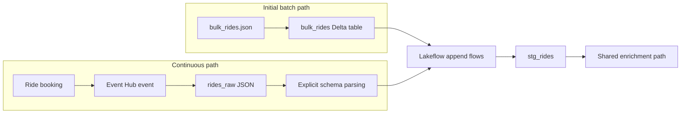
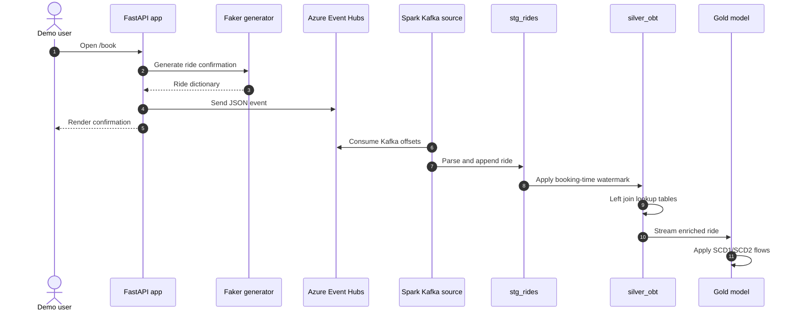
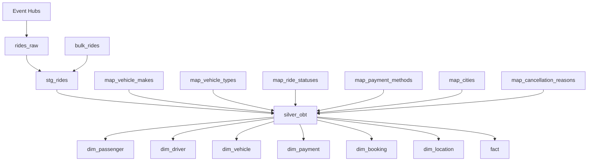

# Architecture

## Component architecture

## Batch and streaming convergence

The bulk table establishes history, while live events continuously enter the same streaming target.

## Real-time sequence

## Lakehouse lineage

## Processing semantics

| Stage | Behavior |
|---|---|
| Event ingestion | Reads from earliest offsets and fails on detected data loss |
| Throughput | Limits each trigger to 10,000 offsets |
| Live parsing | Uses a declared Spark `StructType` |
| Batch/live merge | Appends both streams into `stg_rides` |
| OBT enrichment | Uses left joins to preserve rides without lookup matches |
| Event time | Watermarks `booking_timestamp` by three minutes |
| Gold | Deduplicates business keys before CDC application |
| Location | Maintains Type 2 history using `city_updated_at` |

## Security boundaries

- The local producer needs an Event Hubs connection string.
- The Databricks pipeline needs the Kafka-compatible connection string through Spark configuration.
- The batch loader needs ADLS read access.
- Production deployments should use workload identity, Unity Catalog storage credentials, and secret scopes instead of embedded connection strings or SAS tokens.
