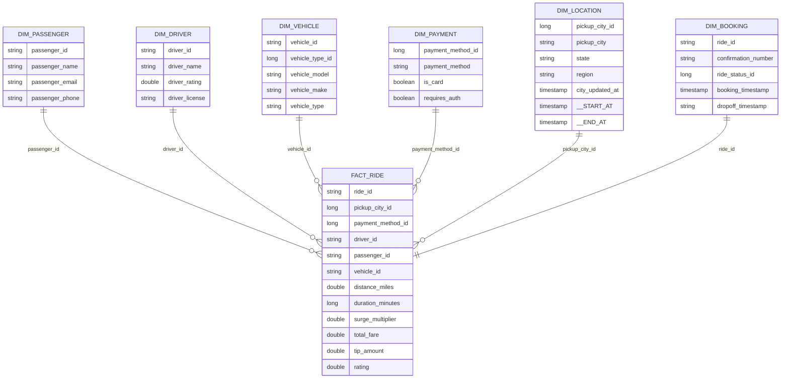

# Data model

## Gold star schema



Relationships are logical join paths; the pipeline does not declare physical foreign-key constraints.

## Table grains

| Table | Grain | History |
|---|---|---|
| `fact` | One current row per composite ride/entity key | SCD Type 1 |
| `dim_passenger` | One current row per passenger | SCD Type 1 |
| `dim_driver` | One current row per driver | SCD Type 1 |
| `dim_vehicle` | One current row per vehicle | SCD Type 1 |
| `dim_payment` | One current row per payment-method ID | SCD Type 1 |
| `dim_booking` | One current row per ride ID | SCD Type 1 |
| `dim_location` | One row per city version | SCD Type 2 |

## OBT enrichment

| Ride key | Lookup | Added attributes |
|---|---|---|
| `vehicle_make_id` | `map_vehicle_makes` | Vehicle make |
| `vehicle_type_id` | `map_vehicle_types` | Type, description, pricing rates |
| `ride_status_id` | `map_ride_statuses` | Ride status |
| `payment_method_id` | `map_payment_methods` | Method, card flag, authentication flag |
| `pickup_city_id` | `map_cities` | City, state, region, update time |
| `cancellation_reason_id` | `map_cancellation_reasons` | Cancellation reason |

## Example query

```sql
SELECT
  l.region,
  COUNT(*) AS rides,
  ROUND(AVG(f.surge_multiplier), 2) AS avg_surge,
  ROUND(SUM(f.total_fare), 2) AS revenue
FROM uber.bronze.fact AS f
JOIN uber.bronze.dim_location AS l
  ON f.pickup_city_id = l.pickup_city_id
 AND l.__END_AT IS NULL
GROUP BY l.region
ORDER BY revenue DESC;
```

## Modeling considerations

- CDC flows use IDs for `sequence_by`; use a monotonic event timestamp where records can change.
- Cancellation details and ride status are generated independently, so synthetic combinations can conflict. Derive both from one state decision when consistency is required.
- Location models pickup city only. Add a role-playing drop-off dimension for route analytics.
- Add explicit schemas, expectations, and relationship tests to strengthen the Gold contract.
