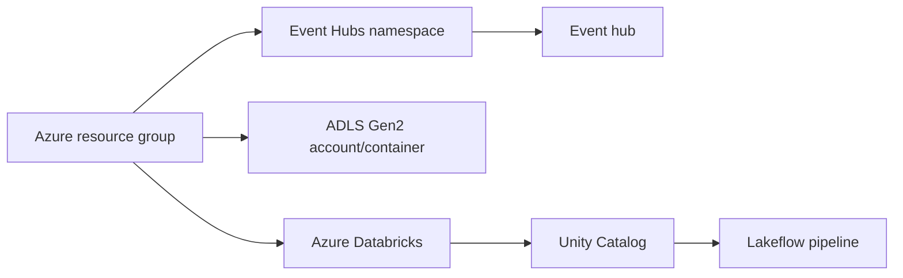

# Deployment and operations

## Required resources



## Configuration matrix

| Setting | Local application | Databricks | Current location |
|---|---|---|---|
| Event Hubs connection | `CONNECTION_STRING` | Spark config `connection_string` | `.env` / pipeline config |
| Event hub name | `EVENT_HUBNAME` | `EH_NAME` | `.env` / `ingest.py` |
| Namespace | Producer connection | `EH_NAMESPACE` | connection / `ingest.py` |
| Raw storage | Not used | ADLS URL or governed location | `bronze_adls.ipynb` |
| Catalog/schema | Not used | `uber.bronze` references | transformations |

## Deployment order

1. Provision Event Hubs and ADLS Gen2.
2. Provision Databricks and configure Unity Catalog.
3. Upload lookup and bulk JSON data to the raw landing area.
4. Create the `uber` catalog and required schemas.
5. Run the Bronze batch-load notebook with environment-specific paths.
6. Configure the Event Hubs connection string securely for the pipeline.
7. Create the Lakeflow pipeline with `ingest.py`, `silver.py`, `silver_obt.sql`, and `model.py`.
8. Start the pipeline and confirm it is healthy.
9. Configure the FastAPI `.env` and publish a test ride.
10. Validate every lakehouse layer.

## Smoke tests

```bash
uv run python -c "from data import generate_uber_ride_confirmation; print(generate_uber_ride_confirmation()['ride_id'])"
curl http://localhost:8000/
curl http://localhost:8000/book
```

```sql
SELECT COUNT(*) FROM uber.bronze.bulk_rides;
SELECT COUNT(*) FROM uber.bronze.rides_raw;
SELECT COUNT(*) FROM uber.bronze.stg_rides;
SELECT COUNT(*) FROM uber.bronze.silver_obt;
SELECT COUNT(*) FROM uber.bronze.fact;
```

## Monitoring checklist

- Event Hubs incoming messages, throttling, and consumer lag
- Spark input and processed rows per second
- Kafka offset progress and data-loss failures
- Lakeflow update status and event-log failures
- Null or malformed parsed ride payloads
- Late-event behavior around the three-minute watermark
- Lookup join miss rates and layer-to-layer row-count changes
- CDC inserts, updates, and unexpected duplicate keys

## Environment strategy

```text
dev:  uber_dev.bronze / uberevents-dev / ubertopic-dev
test: uber_test.bronze / uberevents-test / ubertopic-test
prod: uber_prod.bronze / uberevents-prod / ubertopic-prod
```

Use a Databricks Asset Bundle to version pipeline resources, variables, permissions, and target-specific deployment settings.

## Recovery guidance

- If the producer fails, validate the connection string, hub name, firewall, and quota.
- If Kafka ingestion fails, validate SASL configuration and the pipeline secret.
- If JSON parsing yields null structures, compare the payload to `rides_schema` and quarantine incompatible events.
- If the batch append repeats, inspect initialization and checkpoint state before refreshing.
- Do not reset production checkpoints without understanding replay and duplicate behavior.
